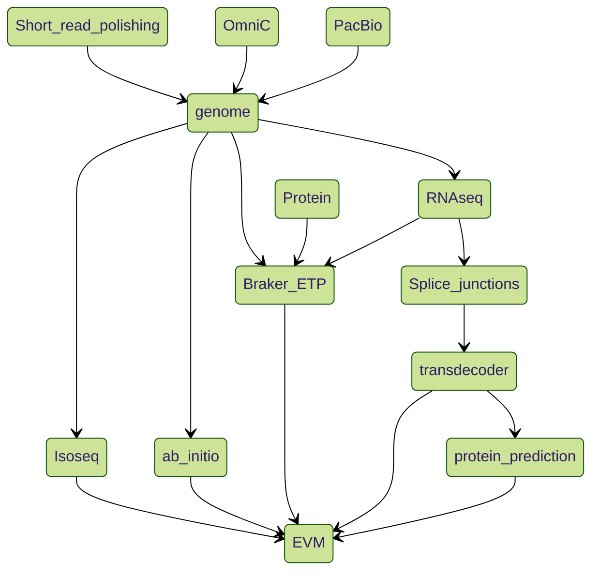

# Genome_assembly_annotation

Authors: Zhou wu090& Langqing liu194

Major Update: *20220322*

The code should be used with your own input to replace the test.files


## :bar_chart: Assessment

### Genome_statistic

N50, N90 Calculation

### RepeatMask

```bash
# Run RepeatModeler to generate repeat library
RepeatModeler -ninja_dir ${ninja_path} -pa ${threads} -LTRStruct -database ${PREFIX}_masked

# Run RepeatMasker with repeat library to mask repeats in genome and output results in GFF format
export BLASTDB_LMDB_MAP_SIZE=100000000
RepeatMasker -pa ${threads} -lib ${PREFIX}-families.fa -xsmall -s -pa 4 -gff -dir ${OUTPUT}/repeatmasker/ ${GENOME}
```

## :joy_cat: Kmer
`Kmer_jellyfish.sh` Using jellyfish to calculate the Kmer

## :scissors: Purge_dups

### Purge_post

Ater Purge_dups, I used my python code to select those regions at the end of the begining of a scaffold. 
See **Purge_post/**  

`Parse_purge_dups_opt.py`, `test.bed`, `test.chr_size`, and `test.out`

```bash
python3 Parse_purge_dups.py -i test.bed -s test.chr_size -o test.out
```

## :curly_loop: Mitochondrial DNA

`run_mito_mapp.sh` and `remove_fa.sh`

## :pushpin: Busco

`BUSCO.sh`

```sh
busco -i test.fa -o  test_vertebrata_busco --out_path ./busco -m genome -l vertebrata_odb10 -c 16 -f
```

## :triangular_ruler: Dot-plot Comparative genome

`make_dot_nucmur.sh` and `mummerCoordsDotPlotly.R` (adopted from tpoorten/dotPlotly )

## :trumpet: Genome annotation pipeline(see below)

## :eyes: Scripts to create figures in paper
`Fig1_circos.R`, `Fig2_dot.R`, `Fig3_BUSCO.R`, `Fig4_chr_features.R`

## Pipeline



## Cite this article

Wu, Z., Miedzinska, K., Krause, J.S. et al. A chromosome-level genome assembly of a free-living white-crowned sparrow (Zonotrichia leucophrys gambelii). Sci Data 11, 86 (2024). https://doi.org/10.1038/s41597-024-02929-6

